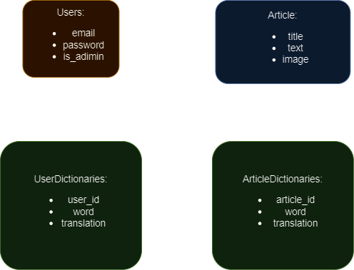

# My Dictionary App

## Описание проекта

Приложение представляет собой словарь, который помогает людям запоминать новые слова. Также оно предоставляет подборки новых слов, которые создаются администратором.

## Установка и настройка

### Требования

-   PHP 8.1
-   Composer
-   Node.js & npm
-   MySQL

### Установка

> Если вы хотите использовать **Docker Compose**:
>
> 1.  Клонируйте репозиторий:
>
> ```bash
> git clone https://github.com/gyrovbogdan/my-dict.git
> ```
>
> 2.  Перейдите в директорию проекта:
>
> ```bash
> cd my-dict
> ```
>
> 3. Запустите контейнеры:
>
> ```bash
>    docker-compose up -d
> ```
>
> 4. Скопируйте файл `.env.example` в `.env`:
>
> ```bash
>   cp .env.example .env
> ```
>
> 5. Установите зависимости, и настройте Laravel с помощью скрипта run.sh:
>
> ```bash
>   docker exec my_dict_app bash ./my-dict/docker/run.sh
> ```
>
> Сайт будет доступен по адресу `http://localhost:8080`

Для обычной установки следуйте следующей инструкции:

1.  Клонируйте репозиторий:

    ```bash
    git clone https://github.com/gyrovbogdan/my-dict.git
    ```

2.  Перейдите в директорию проекта:

    ```bash
    cd my-dict
    ```

3.  Установите зависимости PHP с помощью Composer:

    ```bash
    composer install
    ```

4.  Установите зависимости JavaScript с помощью npm:

    ```bash
    npm install
    ```

5.  Скопируйте файл `.env.example` в `.env` и настройте его:

    ```bash
    cp .env.example .env
    ```

6.  Сгенерируйте ключ приложения:

    ```bash
    php artisan key:generate
    ```

7.  Настройте базу данных и выполните миграции:

    ```bash
    php artisan migrate
    ```

8.  Запустите сервер разработки:
    ```bash
    php artisan serve
    ```

## Использование

После установки и запуска приложения перейдите по адресу `http://localhost:8000` в вашем браузере. Вы сможете увидеть главную страницу приложения, где неавторизованные пользователи увидят стартовые слова, а авторизованные пользователи – свой личный словарь.

## Архитектура и структура проекта

### База данных



#### Основные сущности

-   **User** — пользователь, который имеет свой личный словарь (User Dictionary).
-   **User Dictionary** — личный словарь пользователя, состоящий из таблицы слов и их переводов.
-   **Article** — статья, по теме которой создается словарь (Article Dictionary).
-   **Article Dictionary** — словарь по определенной теме для статьи (Article).

#### Web Controllers

-   **Home Controller**
    -   Главная страница — отображает таблицу со словами пользователя или стартовые слова для неавторизованных пользователей.
-   **Article Controller**
    -   CRUD операции для статей (Article).

#### API Controllers

-   **Translate Controller**
    -   Переводит текст для словаря.
-   **User Dictionary Controller**
    -   CRUD операции для работы с таблицей слов пользователя.
-   **Article Dictionary Controller**
    -   CRUD операции для работы со словарем статьи.

### Jquery Frontend

Frontend часть приложения реализована на jQuery и представляет собой два класса: `Dictionary` и `Api`.

#### Dictionary

-   Отображает таблицу со словами и их переводами.
-   Обеспечивает пагинацию.
-   Задает обработчики событий для создания, обновления, удаления и перевода строк.

#### Api

-   Содержит методы, которые отправляют AJAX запросы для CRUD операций со словарем.
-   Содержит запросы для перевода слов.

## Технологии

-   Laravel 10
-   jQuery 3.7
-   MySQL 8.4
-   Bootstrap 5

## Контакты

Если у вас есть вопросы или предложения, пожалуйста, свяжитесь со мной по адресу [gyrovbogdan@gmail.com](mailto:gyrovbogdan@gmail.com).
